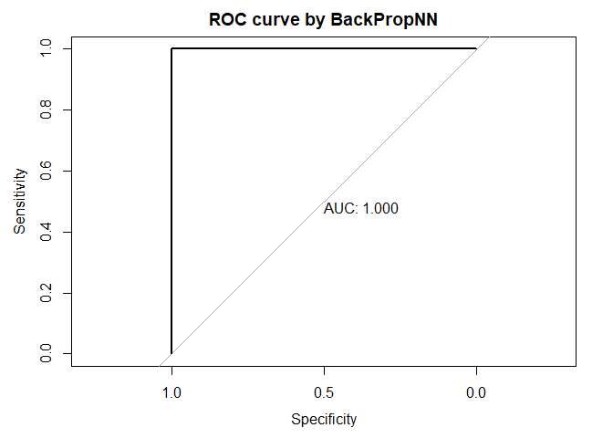
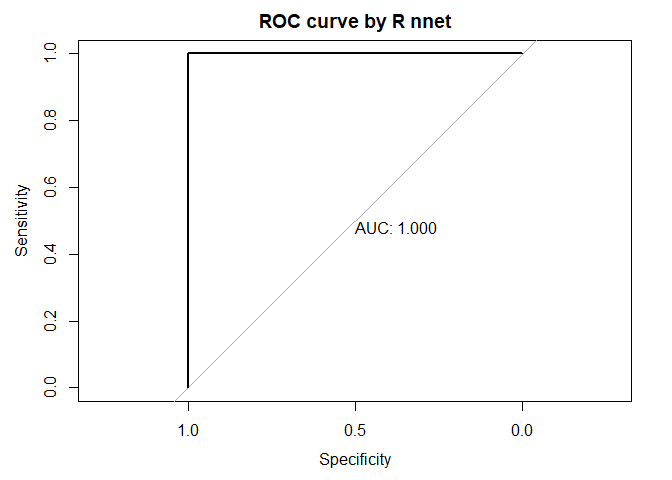

<!-- README.md is generated from README.Rmd. Please edit that file -->

# BackPropNN

<!-- badges: start -->
<!-- badges: end -->

The neural network algorithm trained by the process of backpropagation
is implemented. The stochastic gradient descent (SGD) is adopted for
this algorithm i.e., the weight and bias matrices are updated after
learning from the errors of each dataset point one by one. In this
package, 3 layer (input, one hidden and output) neural network is
considered. The mathematical equation involved are given below,

FeedForward: \[H\] = sigma(\[W_IH\].\[I\] + \[B_H\]) \[O\] =
sigma(\[W_HO\].\[H\] + \[B_O\])

Backpropagation: \[delta_W\_HO\] =
(learning_rate)\[Output_Errors\]x\[O(1-O)\].\[H_tranpose\]
\[delta_W\_IH\] =
(learning_rate)\[Hiddden_Errors\]x\[H(1-H)\].\[I_tranpose\]
\[delta_B\_O\] = (learning_rate)\[Output_Errors\]x\[O(1-O)\]
\[delta_B\_H\] = (learning_rate)\[Hidden_Errors\]x\[H(1-H)\]

Where, \[\] represents the matrix, x represents the Hadamard
multiplication (elementwise), and . represents the usual matrix
multiplication. H represents hidden matrix, O represents output matrix,
W_IH represents weight matrix between input layer and hidden layer, W_HO
represents weight matrix between hidden layer and output layer, B_H
represents bias matrix for hidden layer, B_O represents bias matrix for
output layer. The chosen activation function are Sigmoid or ReLU.

## Installation

You can install the development version of BackPropNN like so:

``` r
install.packages("BackPropNN")
```

## Example

This is a basic example which shows you how to solve a common problem:

``` r
library(BackPropNN)
num_obs <- 1000
X1=sample(c(0,1),num_obs, replace = TRUE)
X2=sample(c(0,1),num_obs, replace = TRUE)
data <- data.frame(X1,X2,Y=ifelse(X1==0 & X2==0, 0, 1)) # Setting up the data
i <- 2 # number of input nodes, which must be equal to the number of X variables.
h <- 4 # number of hidden nodes
o <- 1 # number of output nodes
learning_rate <- 0.1 # The learning rate of the algorithm
activation_func <- "sigmoid" # the activation function
nn_model <- back_propagation_training(i, h, o, learning_rate, activation_func, data)

# Plot (ROC-AUC curve), summary and print function.
plot(nn_model)
#> Setting levels: control = 0, case = 1
#> Setting direction: controls < cases
#> Setting levels: control = 0, case = 1
#> Setting direction: controls < cases
```



    #> 
    #> Call:
    #> roc.default(response = data[, ncol(data)], predictor = nn_R_pred,     plot = TRUE, print.auc = TRUE, main = "ROC curve by R nnet")
    #> 
    #> Data: nn_R_pred in 259 controls (data[, ncol(data)] 0) < 741 cases (data[, ncol(data)] 1).
    #> Area under the curve: 1
    summary(nn_model)
    #> $num_nodes
    #>  # of input nodes # of hidden nodes # of output nodes 
    #>                 2                 4                 1 
    #> 
    #> $activation_function
    #> [1] "sigmoid"
    #> 
    #> $learning_rate
    #> [1] 0.1
    #> 
    #> $weight_bias_matrices
    #> $weight_bias_matrices$weight_input_hidden
    #>             X1        X2
    #> [1,] 0.7575685 0.8095009
    #> [2,] 0.7575685 0.8095009
    #> [3,] 0.7575685 0.8095009
    #> [4,] 0.7575685 0.8095009
    #> 
    #> $weight_bias_matrices$weight_hidden_output
    #>           [,1]      [,2]      [,3]      [,4]
    #> [1,] 0.3478163 0.3478163 0.3478163 0.3478163
    #> 
    #> $weight_bias_matrices$bias_hidden
    #>            [,1]
    #> [1,] -0.1894798
    #> [2,] -0.1894798
    #> [3,] -0.1894798
    #> [4,] -0.1894798
    #> 
    #> $weight_bias_matrices$bias_output
    #>             [,1]
    #> [1,] -0.04860864
    print(nn_model)
    #> Warning: Some expressions had a GC in every iteration; so filtering is disabled.
    #> # A tibble: 2 x 13
    #>   expression   min median `itr/sec` mem_alloc gc/se~1 n_itr  n_gc total~2 result
    #>   <bch:expr> <dbl>  <dbl>     <dbl>     <dbl>   <dbl> <int> <dbl> <bch:t> <list>
    #> 1 BackPropNN  63.5   13.9       1        1        Inf    11    15   525ms <NULL>
    #> 2 R nnet       1      1        12.7      5.88     NaN   134     0   505ms <NULL>
    #> # ... with 3 more variables: memory <list>, time <list>, gc <list>, and
    #> #   abbreviated variable names 1: `gc/sec`, 2: total_time
    #> $mse_comparison
    #>     MSE by R nnet MSE by BackPropNN 
    #>         0.0000000         0.1668857
