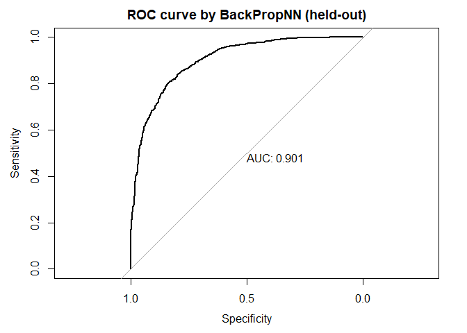
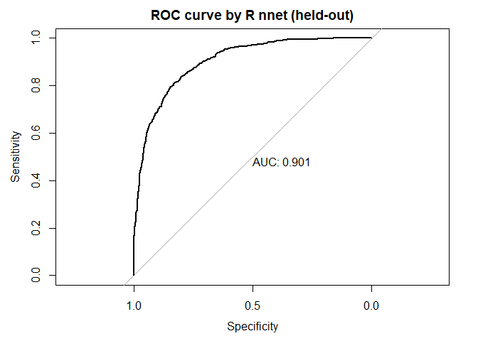

<!-- README.md is generated from README.Rmd. Please edit that file -->

# BackPropNN

<!-- badges: start -->

[](https://github.com/SinghRavin/BackPropNN/actions/workflows/R-CMD-check.yaml)

<!-- badges: end -->

The neural network algorithm trained by the process of backpropagation
is implemented. The stochastic gradient descent (SGD) is adopted for
this algorithm i.e., the weight and bias matrices are updated after
learning from the errors of each data set point one by one. In this
package, 3 layer (input, one hidden and output) neural network is
considered. The mathematical equation involved are given below,

**Feed Forward:**

\[H\] = sigma(\[W_IH\].\[I\] + \[B_H\])

\[O\] = sigma(\[W_HO\].\[H\] + \[B_O\])

**Backpropagation:**

\[delta_W_HO\] =
(learning_rate)\[Output_Errors\]x\[O(1-O)\].\[H_tranpose\]

\[delta_W_IH\] =
(learning_rate)\[Hiddden_Errors\]x\[H(1-H)\].\[I_tranpose\]

\[delta_B_O\] = (learning_rate)\[Output_Errors\]x\[O(1-O)\]

\[delta_B_H\] = (learning_rate)\[Hidden_Errors\]x\[H(1-H)\]

Where, \[\] represents the matrix, x represents the Hadamard
multiplication (element-wise), and . represents the usual matrix
multiplication. H represents hidden matrix, O represents output matrix,
W_IH represents weight matrix between input layer and hidden layer, W_HO
represents weight matrix between hidden layer and output layer, B_H
represents bias matrix for hidden layer, B_O represents bias matrix for
output layer. The chosen activation function are Sigmoid or ReLU.

Weights are initialised randomly with variance 1/fan-in, and biases at
zero. Both the R and the C++ engines draw from R’s RNG stream, so
`set.seed()` gives identical weights in either engine. The `epochs`
argument controls how many complete passes are made over the data; it
defaults to 1.

## Installation

You can install the development version of BackPropNN from GitHub like
so:

``` r
# install.packages("devtools")
devtools::install_github("SinghRavin/BackPropNN")
```

## Example

This is a basic example which shows you how to solve a common problem:

# Simulated data - Logistics data.

``` r
library(BackPropNN) # Loading the package.

set.seed(100)
num_obs <- 10000 # Number of observations.

# Setting coefficients values for the logit function.
beta0 <- -13.6
beta1 <- 0.10
beta2 <- 0.05

# Simulating the independent variables.
X1 <- runif(n=num_obs, min=18, max=60)
X2 <- runif(n=num_obs, min=100, max=250)
prob <- exp(beta0 + beta1*X1 + beta2*X2) / (1 + exp(beta0 + beta1*X1 + beta2*X2))

# Generating binary outcome variable.
Yvec <- rbinom(n=num_obs, size=1, prob=prob)

# Predictors are standardised. A sigmoid saturates when inputs are on the raw
# scale (X2 averages 175), which stalls learning in every engine compared here.
data <- data.frame(X1 = as.numeric(scale(X1)),
                   X2 = as.numeric(scale(X2)),
                   Y  = Yvec)
X  <- as.matrix(data[, 1:2])
Ym <- as.matrix(data[, 3])
```

# Running the functions of BackPropNN package.

``` r
i <- 2 # number of input nodes
h <- 4 # number of hidden nodes
o <- 1 # number of output nodes
learning_rate <- 0.1 # The learning rate of the algorithm
activation_func <- "sigmoid" # the activation function
epochs <- 10 # number of complete passes over the data

set.seed(1)
nn_model <- back_propagation_training(i, h, o, learning_rate, activation_func,
                                      data, epochs = epochs)
```

# Summarizing the results of nn_model.

``` r
nn_model
#> A 3-layer neural network trained by backpropagation
#> 
#>   Input nodes   : 2 
#>   Hidden nodes  : 4 
#>   Output nodes  : 1 
#>   Activation    : sigmoid 
#>   Learning rate : 0.1 
#>   Training rows : 10000 
#>   In-sample MSE : 0.1204
summary(nn_model)
#> $num_nodes
#>  # of input nodes # of hidden nodes # of output nodes 
#>                 2                 4                 1 
#> 
#> $activation_function
#> [1] "sigmoid"
#> 
#> $learning_rate
#> [1] 0.1
#> 
#> $weight_bias_matrices
#> $weight_bias_matrices$weight_input_hidden
#>             X1        X2
#> [1,]  1.119254  2.149039
#> [2,] -2.313731 -3.688991
#> [3,]  1.239835  2.840185
#> [4,]  2.170264  2.719256
#> 
#> $weight_bias_matrices$weight_hidden_output
#>           [,1]      [,2]     [,3]     [,4]
#> [1,] 0.9573678 -2.354976 1.608131 1.676876
#> 
#> $weight_bias_matrices$bias_hidden
#>           [,1]
#> [1,] -1.440733
#> [2,] -2.186461
#> [3,] -3.058938
#> [4,] -2.271660
#> 
#> $weight_bias_matrices$bias_output
#>           [,1]
#> [1,] -1.066418
```

## A note on what “fair” means here

`nnet` optimises with BFGS: one weight update per iteration, each using
a gradient computed over the whole data set. `BackPropNN` uses
stochastic gradient descent: one weight update per observation. Ten
passes over 10,000 rows is therefore 100,000 updates for `BackPropNN`
and 10 updates for `nnet`. The two are not interchangeable, so the
comparisons below are reported in two separate ways:

- **Speed** is compared at an equal number of passes over the data,
  since a pass costs the same arithmetic in every engine. This isolates
  implementation efficiency, which is what the Rcpp rewrite was meant to
  address.
- **Accuracy** is compared with each engine run to convergence under its
  own optimiser.

The timing and accuracy tables below were produced by
[`inst/benchmarks/fair_benchmark.R`](inst/benchmarks/fair_benchmark.R)
in a single run on 20 July 2026 (Windows, R version 4.4.2 (2024-10-31
ucrt), nnet 7.3.19). They are read from a saved file rather than re-run
at knit time, so the published figures stay fixed between builds. Re-run
that script to refresh them.

# Speed: training, at an equal number of passes

``` r
results$train
#> # A data frame: 3 × 6
#>   expression      min   median `itr/sec` mem_alloc `gc/sec`
#>   <bch:expr> <bch:tm> <bch:tm>     <dbl> <bch:byt>    <dbl>
#> 1 Pure R        7.13s    7.97s     0.118  260.47KB     7.77
#> 2 Rcpp         48.2ms   49.7ms    20.2    472.25KB     0   
#> 3 nnet         9.04ms  45.42ms    18.3      1.43MB     0
results$train_rel
#> # A data frame: 3 × 6
#>   expression    min median `itr/sec` mem_alloc `gc/sec`
#>   <bch:expr>  <dbl>  <dbl>     <dbl>     <dbl>    <dbl>
#> 1 Pure R     789.   175.          1       1         Inf
#> 2 Rcpp         5.33   1.09      172.      1.81      NaN
#> 3 nnet         1      1         155.      5.64      NaN
```

# Speed: prediction

``` r
results$pred
#> # A data frame: 3 × 6
#>   expression      min   median `itr/sec` mem_alloc `gc/sec`
#>   <bch:expr> <bch:tm> <bch:tm>     <dbl> <bch:byt>    <dbl>
#> 1 Pure R     845.38ms    1.02s     0.931   262.6KB     9.49
#> 2 Rcpp         3.41ms   3.69ms   247.       80.6KB     0   
#> 3 nnet        896.1µs 985.45µs   890.      837.9KB     8.90
results$pred_rel
#> # A data frame: 3 × 6
#>   expression    min  median `itr/sec` mem_alloc `gc/sec`
#>   <bch:expr>  <dbl>   <dbl>     <dbl>     <dbl>    <dbl>
#> 1 Pure R     943.   1036.          1       3.26      Inf
#> 2 Rcpp         3.81    3.75      265.      1         NaN
#> 3 nnet         1       1         956.     10.4       Inf
```

The R and C++ engines are the same algorithm, so given the same seed
they must produce the same weights. The benchmark script asserts this,
and it held: TRUE.

# Accuracy

Models are trained on 70% of the data and evaluated on the held-out 30%,
averaged over 5 random initialisations. The C++ engine is used for the
repeated fits because it produces weights identical to the R engine at a
fraction of the cost.

Both engines are run well past the point of improvement so that
convergence is demonstrated rather than assumed. `BackPropNN` is flat
from 10 epochs onward. `nnet` climbs until roughly 500 iterations and is
then identical at 2000, because BFGS reaches its convergence tolerance
and stops early — which is also why its 2000-iteration fit takes no
longer than its 500-iteration fit.

``` r
knitr::kable(results$accuracy, digits = 4)
```

| engine                  |    auc |    mse |
|:------------------------|-------:|-------:|
| BackPropNN, 10 epochs   | 0.9004 | 0.1253 |
| BackPropNN, 100 epochs  | 0.9010 | 0.1251 |
| BackPropNN, 500 epochs  | 0.9008 | 0.1250 |
| BackPropNN, 2000 epochs | 0.9006 | 0.1252 |
| nnet, 10 iterations     | 0.8558 | 0.1613 |
| nnet, 100 iterations    | 0.8865 | 0.1297 |
| nnet, 500 iterations    | 0.8933 | 0.1268 |
| nnet, 2000 iterations   | 0.8933 | 0.1268 |

# ROC curves on held-out data

Both models are fitted on the same 70% training split and evaluated on
the same held-out 30%, each run to convergence: 100 epochs for
`BackPropNN`, 500 BFGS iterations for `nnet`. These curves come from a
single seed, so their AUCs are close to but not identical to the
averaged figures in the table above.

``` r
set.seed(100)
train_idx <- sample(seq_len(num_obs), size = round(0.7 * num_obs))
train <- data[train_idx, ]
test  <- data[-train_idx, ]

X_tr <- as.matrix(train[, 1:2]); Y_tr <- as.matrix(train[, 3])
X_te <- as.matrix(test[, 1:2])

set.seed(1)
fit_bp <- back_propagation_training_rcpp(i, h, o, learning_rate, activation_func,
                                         as.matrix(train), epochs = 100)
set.seed(1)
fit_nnet <- nnet::nnet(X_tr, Y_tr, size = h, maxit = 500, trace = FALSE)

invisible(pROC::roc(test$Y, as.numeric(feed_forward_rcpp(test, fit_bp)),
                    plot = TRUE, print.auc = TRUE, quiet = TRUE,
                    main = "ROC curve by BackPropNN (held-out)"))
```



``` r

invisible(pROC::roc(test$Y, as.numeric(stats::predict(fit_nnet, X_te, type = "raw")),
                    plot = TRUE, print.auc = TRUE, quiet = TRUE,
                    main = "ROC curve by R nnet (held-out)"))
```



# Cost against accuracy

The practitioner’s question is what accuracy a model reaches and what it
cost to get there. This table pairs the two, and is directly comparable
across engines regardless of the SGD/BFGS difference. Training time is
the median of five fits at a fixed seed.

``` r
knitr::kable(results$cost_accuracy, digits = 4, row.names = FALSE)
```

| engine                | train_sec |    auc |    mse |
|:----------------------|----------:|-------:|-------:|
| Pure R, 10 epochs     |     10.29 | 0.9004 | 0.1253 |
| Rcpp, 10 epochs       |      0.06 | 0.9004 | 0.1253 |
| Rcpp, 100 epochs      |      0.89 | 0.9010 | 0.1251 |
| Rcpp, 500 epochs      |      2.69 | 0.9008 | 0.1250 |
| Rcpp, 2000 epochs     |     10.68 | 0.9006 | 0.1252 |
| nnet, 10 iterations   |      0.14 | 0.8558 | 0.1613 |
| nnet, 100 iterations  |      0.97 | 0.8865 | 0.1297 |
| nnet, 500 iterations  |      1.91 | 0.8933 | 0.1268 |
| nnet, 2000 iterations |      1.72 | 0.8933 | 0.1268 |

# What these results show

**The C++ rewrite is where the speed came from, and the gap to `nnet` is
modest.** At an equal number of passes over the data, the Rcpp engine is
two orders of magnitude faster than the pure R engine. It remains
somewhat slower than `nnet`, whose inner loop is compiled C that has
been tuned for decades. The interesting quantity is not that C++ beats
interpreted R, which is expected, but that a straightforward Armadillo
implementation lands within a small factor of a mature reference
implementation. Timings come from a single Windows machine and vary with
system load, so the ordering is reliable but the exact multiples are
approximate.

**The bottleneck was the interpreted loop, not the arithmetic.** The
pure R engine allocates an S3 list on every activation call, resolves a
closure on every call, and coerces matrices once per row. The garbage
collector runs hundreds of times during a single benchmark; the C++
engine triggers it zero times and allocates less memory than `nnet`. The
algorithm is unchanged between the two engines: same initialisation,
same update order, same equations.

**Both engines converge, to different optima.** `BackPropNN` settles at
an AUC of about 0.901 and does not move between 10 and 2000 epochs.
`nnet` settles at about 0.893, reached by 500 iterations and unchanged
at 2000. On this problem the from-scratch implementation converges to a
better optimum, and reaches it in roughly a thirtieth of the time. This
is a statement about these two optimisers on a small network with
well-separated classes, not a general claim about SGD versus BFGS.

**Per pass over the data, SGD extracts far more than BFGS.** At ten
passes `BackPropNN` has made 100,000 weight updates and `nnet` has made
10, which is why the ten-pass rows differ so much. This is a property of
the optimisers, not of the implementations, and it is the reason speed
and accuracy are reported under separate protocols above.

# Known limitations

- The output layer uses the same activation as the hidden layer, so ReLU
  is not appropriate for binary classification with this implementation.
- The number of output nodes is nominally an argument but the prediction
  path assumes a single output.
- There is no convergence check, learning-rate schedule, or
  mini-batching; the training loop runs for exactly the number of epochs
  requested.
- Predictors are not standardised internally. As the comparison above
  shows, this matters a great deal for sigmoid activations, and is left
  to the user.
- `feed_forward_rcpp()` copies its input data frame into a matrix on
  every call, which is a plausible reason prediction lags `nnet`. This
  has not been profiled.
