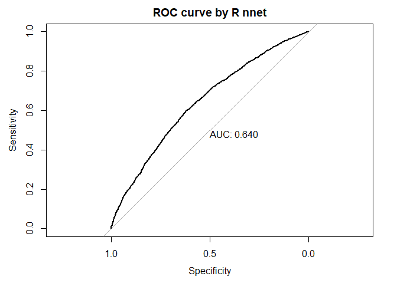

<!-- README.md is generated from README.Rmd. Please edit that file -->

# BackPropNN

<!-- badges: start -->

[](https://github.com/SinghRavin/BackPropNN/actions/workflows/R-CMD-check.yaml)
<!-- badges: end -->

The neural network algorithm trained by the process of backpropagation
is implemented. The stochastic gradient descent (SGD) is adopted for
this algorithm i.e., the weight and bias matrices are updated after
learning from the errors of each dataset point one by one. In this
package, 3 layer (input, one hidden and output) neural network is
considered. The mathematical equation involved are given below,

FeedForward: \[H\] = sigma(\[W_IH\].\[I\] + \[B_H\]) \[O\] =
sigma(\[W_HO\].\[H\] + \[B_O\])

Backpropagation: \[delta_W\_HO\] =
(learning_rate)\[Output_Errors\]x\[O(1-O)\].\[H_tranpose\]
\[delta_W\_IH\] =
(learning_rate)\[Hiddden_Errors\]x\[H(1-H)\].\[I_tranpose\]
\[delta_B\_O\] = (learning_rate)\[Output_Errors\]x\[O(1-O)\]
\[delta_B\_H\] = (learning_rate)\[Hidden_Errors\]x\[H(1-H)\]

Where, \[\] represents the matrix, x represents the Hadamard
multiplication (elementwise), and . represents the usual matrix
multiplication. H represents hidden matrix, O represents output matrix,
W_IH represents weight matrix between input layer and hidden layer, W_HO
represents weight matrix between hidden layer and output layer, B_H
represents bias matrix for hidden layer, B_O represents bias matrix for
output layer. The chosen activation function are Sigmoid or ReLU.

## Installation

You can install the development version of BackPropNN like so:

``` r
install.packages("BackPropNN")
```

## Example

This is a basic example which shows you how to solve a common problem:

# Simulated data - Logistics data.

``` r
library(BackPropNN) # Loading the package.
num_obs <- 10000 # Number of observations

# Setting coefficients values for the logit function.
beta0 <- -2.5
beta1 <- 0.02
beta2 <- 0.01

# Simulating the independent variables.
X1 <- runif(n=num_obs, min=18, max=60)
X2 <- runif(n=num_obs, min=100, max=250)
prob <- exp(beta0 + beta1*X1 + beta2*X2) / (1 + exp(beta0 + beta1*X1 + beta2*X2))

# Generating binary outcome variable.
Y <- rbinom(n=num_obs, size=1, prob=prob)

data <- data.frame(X1, X2, Y)
X <- as.matrix(data[1:ncol(data)-1])
Y <- as.matrix(data[,ncol(data)])
```

# Running the functions of BackPropNN package.

``` r
set.seed(100)
i <- 2 # number of input nodes
h <- 4 # number of hidden nodes
o <- 1 # number of output nodes
learning_rate <- 0.1 # The learning rate of the algorithm
activation_func <- "sigmoid" # the activation function
nn_model <- back_propagation_training(i, h, o, learning_rate, activation_func, data)
```

# Summarizing the results of nn_model.

``` r
plot(nn_model)
#> Setting levels: control = 0, case = 1
#> Setting direction: controls > cases
#> Setting levels: control = 0, case = 1
#> Setting direction: controls < cases
```



    #> 
    #> Call:
    #> roc.default(response = data[, ncol(data)], predictor = nn_R_pred,     plot = TRUE, print.auc = TRUE, main = "ROC curve by R nnet")
    #> 
    #> Data: nn_R_pred in 4907 controls (data[, ncol(data)] 0) < 5093 cases (data[, ncol(data)] 1).
    #> Area under the curve: 0.5
    summary(nn_model)
    #> $num_nodes
    #>  # of input nodes # of hidden nodes # of output nodes 
    #>                 2                 4                 1 
    #> 
    #> $activation_function
    #> [1] "sigmoid"
    #> 
    #> $learning_rate
    #> [1] 0.1
    #> 
    #> $weight_bias_matrices
    #> $weight_bias_matrices$weight_input_hidden
    #>                X1          X2
    #> [1,] -0.004061627 -0.09207148
    #> [2,] -0.004061627 -0.09207148
    #> [3,] -0.004061627 -0.09207148
    #> [4,] -0.004061627 -0.09207148
    #> 
    #> $weight_bias_matrices$weight_hidden_output
    #>            [,1]       [,2]       [,3]       [,4]
    #> [1,] 0.04778198 0.04778198 0.04778198 0.04778198
    #> 
    #> $weight_bias_matrices$bias_hidden
    #>             [,1]
    #> [1,] 0.009415372
    #> [2,] 0.009415372
    #> [3,] 0.009415372
    #> [4,] 0.009415372
    #> 
    #> $weight_bias_matrices$bias_output
    #>             [,1]
    #> [1,] -0.04422943
    print(nn_model)
    #> Warning: Some expressions had a GC in every iteration; so filtering is disabled.
    #> # A tibble: 2 x 13
    #>   expression   min median `itr/sec` mem_alloc gc/se~1 n_itr  n_gc total~2 result
    #>   <bch:expr> <dbl>  <dbl>     <dbl>     <dbl>   <dbl> <int> <dbl> <bch:t> <list>
    #> 1 BackPropNN  31.2   24.3       1        1        Inf     2    27  1000ms <NULL>
    #> 2 R nnet       1      1        10.8      6.82     NaN    11     0   509ms <NULL>
    #> # ... with 3 more variables: memory <list>, time <list>, gc <list>, and
    #> #   abbreviated variable names 1: `gc/sec`, 2: total_time
    #> $mse_comparison
    #>     MSE by R nnet MSE by BackPropNN 
    #>         0.2369955         0.2503279

# Now, let’s check if the Rcpp version of BackPropNN helps to improve the computational speed.

``` r
# Running NN models using both versions.
nn_model_original <- back_propagation_training(i, h, o, learning_rate,
                                          activation_func, data)
nn_model_rcpp <- back_propagation_training_rcpp(i, h, o, learning_rate,
                                          activation_func, as.matrix(data))
nn_model_nnet <- nnet::nnet(X,Y,size=h, trace=FALSE)


# Running the benchmark comparison for training part.
bench::mark("Original"=back_propagation_training(i, h, o, learning_rate,
                                          activation_func, data),
            "R nnet"=nnet::nnet(X,Y,size=h, trace=FALSE),
            "Rcpp"=back_propagation_training_rcpp(i, h, o, learning_rate,
                                          activation_func, as.matrix(data)),
                    relative = TRUE, check = FALSE)
#> Warning: Some expressions had a GC in every iteration; so filtering is disabled.
#> # A tibble: 3 x 6
#>   expression    min median `itr/sec` mem_alloc `gc/sec`
#>   <bch:expr>  <dbl>  <dbl>     <dbl>     <dbl>    <dbl>
#> 1 Original   126.   122.        1         1         Inf
#> 2 R nnet       4.40   6.64      8.21      6.82      NaN
#> 3 Rcpp         1      1       115.        2.41      Inf

# Running the benchmark comparison for predicting part.
bench::mark("Original"=feed_forward(data, nn_model_original),
            "R nnet" = as.numeric(stats::predict(nn_model_nnet,X, type="raw")),
            "Rcpp"=feed_forward_rcpp(data, nn_model_rcpp),
                    relative = TRUE, check = FALSE)
#> Warning: Some expressions had a GC in every iteration; so filtering is disabled.
#> # A tibble: 3 x 6
#>   expression    min median `itr/sec` mem_alloc `gc/sec`
#>   <bch:expr>  <dbl>  <dbl>     <dbl>     <dbl>    <dbl>
#> 1 Original   807.   695.          1       2.77      Inf
#> 2 R nnet       1      1         627.      9.23      Inf
#> 3 Rcpp         2.66   2.36      269.      1         NaN
```

We notice that for the training part, Rcpp version achieves best
computational speed, however for the predicting part, R nnet package
takes the lead (performing just slightly better than Rcpp). The Original
package written in R lags behind in both training and predicting tasks.
